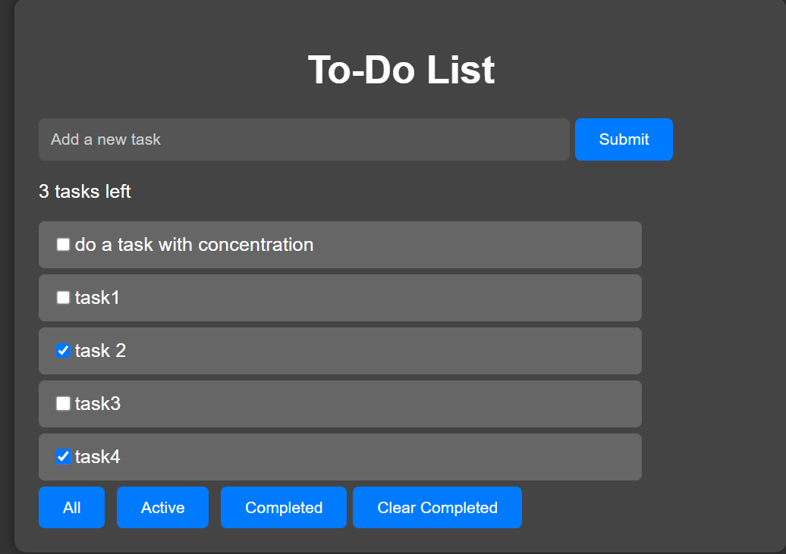

# To-Do List Application

This is a simple web-based to-do list application where you can add tasks, mark them as completed, and filter them based on their completion status.

## Features

- **Add Tasks**: Easily add new tasks to your to-do list.
- **Mark Completed**: Toggle tasks as completed by clicking on the checkboxes.
- **Filter Tasks**: Filter tasks to view all tasks, active tasks, or completed tasks.
- **Clear Completed**: Quickly remove all completed tasks from the list.
- **Responsive Design**: The application is designed to work seamlessly across various screen sizes.

## Preview

## Deployment

The application is deployed and accessible at [https://tech-in-todo.netlify.app/](https://tech-in-todo.netlify.app/).

## Technologies Used

- HTML
- CSS
- JavaScript

## How to Use

1. Visit the deployed application [here](https://tech-in-todo.netlify.app/).
2. Enter a task in the input field and press Enter or click the "Submit" button.
3. To mark a task as completed, click on the checkbox next to the task.
4. Use the buttons to filter tasks based on their completion status.
5. Click on "Clear Completed" to remove all completed tasks from the list.

Enjoy organizing your tasks with this simple to-do list application!

## License

This project is licensed under the [MIT License](LICENSE).
